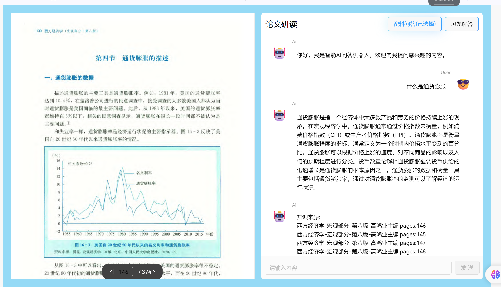

## AI-teacher 后端接口文档

## 1. 项目概述和部署

环境配置：

```
pip install -r requirement.txt
```

项目启动：

```
python server.py
```



## 2. 连接

### 2.1 连接URL

```
ws://ip:port/support
```

### 2.2 支持的事件

- `connect`: 客户端成功连接到服务器时触发。
- `disconnect`: 客户端与服务器断开连接时触发。
- `ai-support`: 客户端请求支持服务时触发。

## 3. 接口描述

### 3.1 支持请求事件 (`ai-support`)

客户端可以通过发送`ai-support`事件来请求支持服务。这个事件需要包含一个`data`对象。

```json
{
     "message": "什么是通货膨胀？",

    "language": "zh-cn",

    "book":"西方经济学-宏观部分-第八版-高鸿业主编",

    "function": "article"
  
}
```

根据`function`的值，服务器将处理不同类型的支持请求：

- `article`: 请求与经济学书籍相关的支持。**知识问答**
- `question`: 请求与经济学问题相关的支持。   **习题解答**

### 3.2知识问答功能 (`ai-support`)

当客户端请求相关经济学概念的文章或解释时，需要发送一个`ai-support`事件，其中包含一个特定格式的`data`对象。这个功能旨在为用户提供关于特定经济学概念的深入解释或相关文章。

**请求格式**:

请求应包含以下字段：

- `message`: 包含请求解释的经济学概念。
- `language`: 指定模型回答的语言，目前支持`zh-cn`（简体中文）和`en-us`（美式英语）。
- `book`: 指定书籍名称，**目前支持“马工程-西方经济学（下）”、“西方经济学-宏观部分-第八版-高鸿业主编”和“Mankiw-Principles of Economics-7th Edition”**。
- `function`: 功能类型，**此处应为`article`。**

```json
{
     "message": "什么是通货膨胀？",

    "language": "zh-cn",

    "book":"马工程-西方经济学（下）",

    "function": "article"
  
}
```

### 流式数据返回

在请求文章或相关内容时，服务器采用流式数据返回方式，以提高数据传输效率和用户体验。这种情况下，服务器将通过两个不同的事件`article_source`和`article_support`来分别传输文章来源信息和文章内容。

**事件类型**: `article_source`

**数据格式**:

```json
{
  "source": "文章或解释的来源信息，如书籍名称、章节、页码等。"
}
```

**描述**:

- 当请求文章或经济学概念解释时，服务器首先通过`article_source`事件发送文章的来源信息。
- 该信息可以包括书籍名称、章节、页码等，帮助用户了解文章内容的出处。

**事件类型**: `article_support`

**数据格式**:

```json
{
  "token": "文章或解释内容的一部分，用于流式传输。"
}
```

**描述**:

- `article_support`事件用于流式传输文章或经济学概念解释的具体内容。
- 客户端应按接收顺序组合这些`token`，以重构完整的文章内容。

### 3.3 习题解答请求 (`ai-support`)

当客户端请求习题解答服务时，需要发送一个`ai-support`事件，其中包含一个特定格式的`data`对象。这个功能旨在为用户提供“西方经济学习题集”中的习题解答。

**请求格式**:

请求应包含以下字段：

- `message`: 包含习题的文本。
- `language`: 指定模型回答的语言，目前支持`zh-cn`（简体中文）和`en-us`（美式英语）。
- `book`: 指定书籍名称，**目前只支持“西方经济学习题集”**。
- `function`: 功能类型，**此处应为`question`。**

```json
{
  "message": "根据相对收入假说，消费倾向在下述哪种情况较高？（ ）A．教育程度较低B．社会地位较低C．拥有较多流动资产D．周围人群消费水平较高",
  "language": "zh-cn",
  "book": "西方经济学习题集",
  "function": "question"
}
```

流式数据返回

对于`question`功能的请求，服务器可以通过两个事件`question_source`和`question-support`来分别处理问题来源信息和问题答案的流式传输。

**事件类型**: `question_source`

**数据格式**:

```json
{
  "source": "问题的来源信息，如相关书籍、文章、章节等。"
}
```

**描述**:

- `question_source`事件用于发送问题的来源信息，帮助用户了解问题背景和出处。
- 来源信息可以包括相关书籍、文章、章节等。

#### 3.7.2 问题支持事件 (`question-support`)

**事件类型**: `questions-support`

**数据格式**:

```json
{
  "token": "问题答案内容的一部分，用于流式传输。"
}
```

**描述**:

- `question-support`事件用于流式传输问题答案的具体内容。
- 客户端应按接收顺序组合这些`token`，以重构完整的问题答案。


